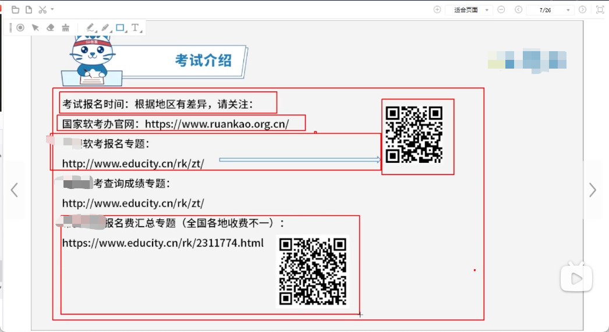

# Software-Designer

2月27号更新

简单想了一下，还是把更新的写在前面。

今天大概去b站上面看了一下她们的备战分享，说实话，考试还是得女生，用2,3周备考过得真的强（在校生）。对于我这种毕业两年多的还是不要考虑了。

这里说一下大概的计划，就是先把视频刷完（现在还在第二章），然后稍微看一下教材（他们都说教材没有必要买），刷到差不多的时候再做题，我表示毕业之后，真的忘了很多，慢慢捡回来。

---

昨天有公众号发布推文，讲了软考大概得**报名开始时间为今年的3月13号**， 这个消息也为平淡的生活增添了一丝丝紧张感，不妨碍每天说着要准备考试，但是每天过得逍遥自在，一点都准备备考，真nice。

去官网看了一下，大概得时间安排：上半年软考时间在5月27/28号，我准备的是软件设计师，考试时间为上午9:00-11:30， 下午是14:00 - 16:30，对于具体考看一方面，可以到官网里面看一下。

[中国计算机技术职业资格网](https://www.ruankao.org.cn/)

下面是考试的基本内容要求，以及其他知识。

[软件考试说明](https://www.ruankao.org.cn/platform/details?code=02_15)

---

今天2月20号，又是什么都没有干的一天，假装自己今天有提交，（苦笑）。今天在希赛上面看到有一个每日一题，下一个手机上面的APP，来刷一下题，然后做一个每日一题的集合。

---

一些简单的需要了解的知识，可以作为参考。

然后就是讲了考试的范围，上午题以及下午题的内容。

## 上午题
- 软件工程基础是指-13-（开发方法与开发模型、数据流图与数据字典、结构化设计、测试方法与McCabe环路复杂度、软件维护、质量特性、CMM、Pert图）
- 面向对象-11-（面向对象基本概念、面向对象分析与设计、UML、设计模式）
- 数据结构与算法-9-（数组、顺序表与链表、队列与栈、字符串、二叉树的存储特性、二叉树遍历、排序二叉树、最优二叉树、图的概念与存储、图的遍历、图的拓扑排序、二分查找、哈希查找、常见的排序算法、常见算法策略）
- 程序设计语言-6-各种程序语言的特点比较、编译与解释、编译器处理过程、错误管理、传值与传址、优先自动机、正规式、后缀表达式）
- 计算机硬件基础
- 操作系统
- 数据库系统
- 计算机网络
- 信息安全知识
- 知识产权与标准化
- 专业英语
## 下午题
- 数据流图（给出相应名称，补充数据流图的缺失的部分，数据流图相关解答题）
- 数据库设计（er模型、关系模型主键外键、规范化理论、增加实体）
- UML建模（类图、用例图、活动图、状态图）
- C语言算法（分治、贪心、动态规划、回溯算法）
- C++程序设计
- Java程序设计

---
